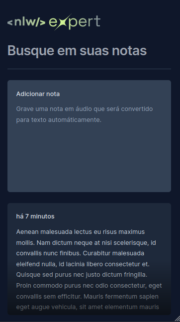
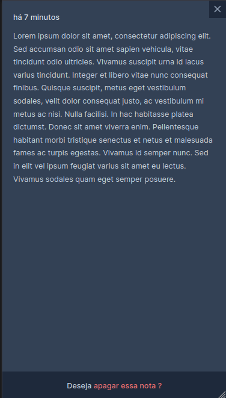
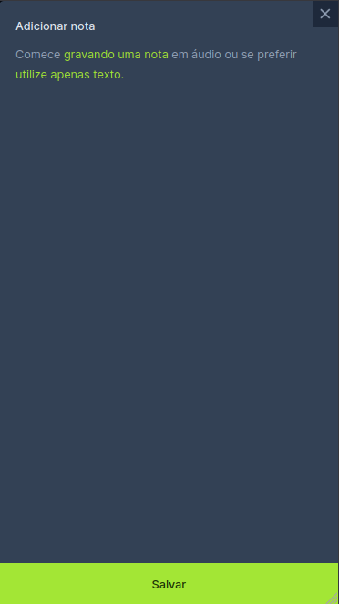
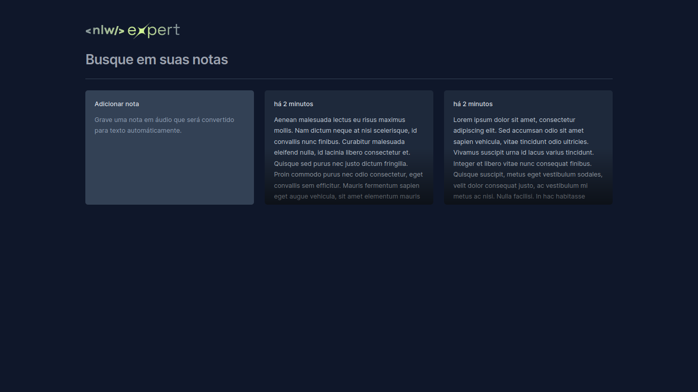
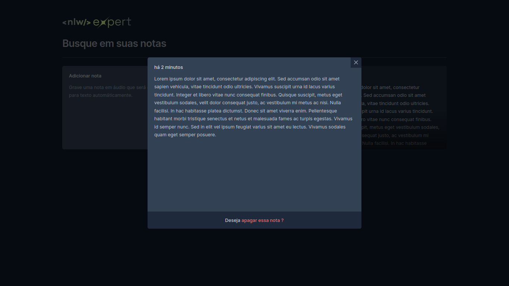
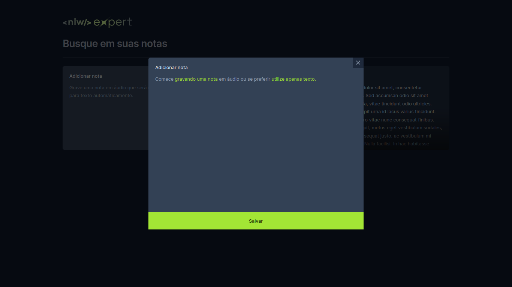

# Rocketseat NLW - Notes

<p align="center">

  
  
  


</p>

<p align="center">
  <a href="#about">About</a> •
  <a href="#installation">Installation</a> •
  <a href="#technologies">Technologies</a> •
  <a href="#author">Author</a>   
</p>

## About

The project developed at this event is a web application built with ReactJS, which allows users to create and manage notes efficiently. A special feature of this application is the integration with the browser's native API, which makes it possible to record notes directly on the user's device.


<div style="display: flex; gap: 10; justify-content: center; align-items: center">



</div>

<div >



</div>


## Installation

Before you begin, you will need to have the following tools installed on your machine: [Git](https://git-scm.com) and [Node.js](https://nodejs.org/en/). Also, it's good to have an editor to work with the code such as [VSCode](https://code.visualstudio.com/).

### 🎲 Running the Front End 

```bash
# Clone this repository
$ git clone https://github.com/Josemar-cafumana/NLW-notes.git

# Navigate to the project's folder in the terminal/cmd
$ cd NLW-notes

# Install dependencies
$ npm install
# If you prefer using Yarn, execute the following command
$ yarn

# Run the application in development mode
$ npm run dev
# If you prefer using Yarn, execute the following command
$ yarn dev

# The server will start on port 5173 - access <http://localhost:5173>
```


## Technologies

Aqui está a lista revisada com os links e descrições corrigidas:

Here's the revised list with corrected links and descriptions:

- [TypeScript](https://www.typescriptlang.org/): A superset of JavaScript that adds optional static typing.

- [ReactJS](https://reactjs.org/): A JavaScript library for building user interfaces.

- [Radix](https://radix-ui.com/): An accessible UI component library for React.

- [Sonner](https://sonner-ui.com/): A modern and elegant UI component library for React.

- [Tailwind CSS](https://tailwindcss.com/): A utility-first CSS framework for rapidly building custom designs.

- [SpeechRecognitionAPI](https://developer.mozilla.org/en-US/docs/Web/API/SpeechRecognition): A browser API that enables real-time speech recognition.

- [Vite](https://vitejs.dev/): A next-generation front-end tooling.


These technologies were chosen to provide an efficient development experience, making project creation easier.

## Author

<div align="center">

<h1>Josemar Cafumana</h1>
<strong>Frontend Developer</strong>
<br/>
<br/>
<div  style="display: flex; align-items: center: justify-content: center; text-align: center">

<a href="https://www.linkedin.com/in/josemar-cafumana-web-developer/" target="_blank">

</a>

<a href="https://github.com/Josemar-cafumana" target="_blank">

</a>

<a href="mailto:rjosemar-cafumana@hotmail.com" target="_blank">

</a>

<a href="https://wa.link/65562r" target="_blank">

</a>

</a>
</div>

<br/>
<br/>
</div>